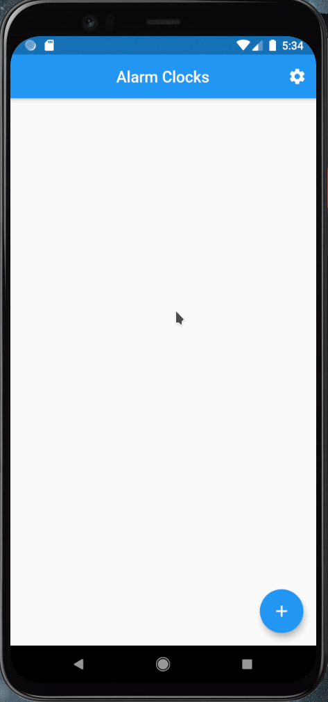
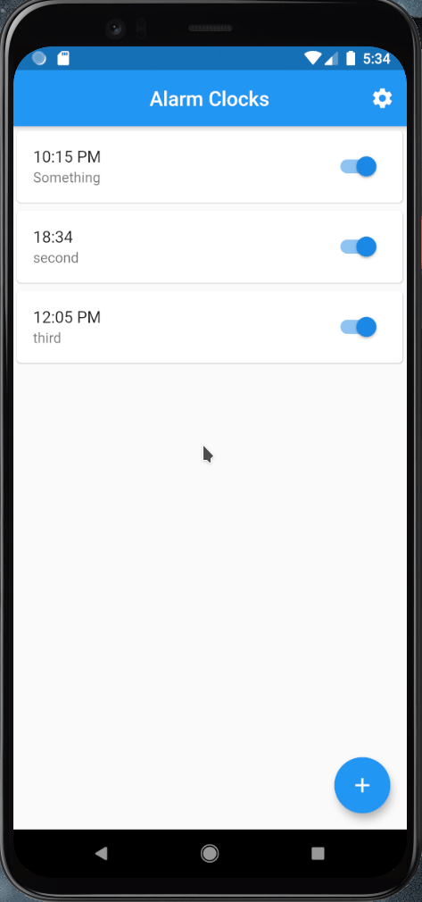

# Alarm Clock
This flutter application is in the **Pre-Alpha 0.0.1** so it doesn't have many
features yet...

# What can it do?
Currently, you can:
- Create, configure and remove alarm clocks
- Set an alarm that rings at the chosen time
- Feature: You have to turn on the lights in your room in order to deactivate
    the clock if it wakes you up!
    
# Bugs that might appear
- It might be the case that a alarm is only repeated twice. For now the user should turn the alarm on and off after it has rang. 

# Demos
### Creating alarm clock

### Configuring alarm clock

### Deleting alarm clock

### Setting light value alarm clock

